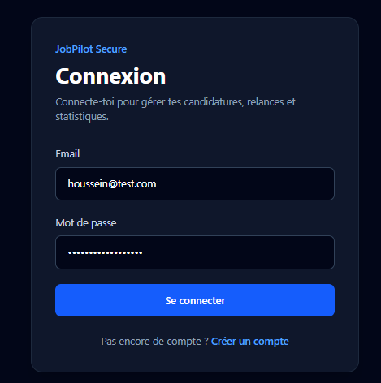
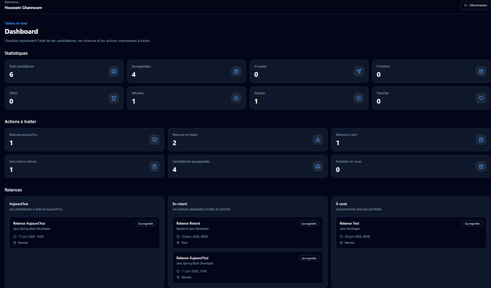
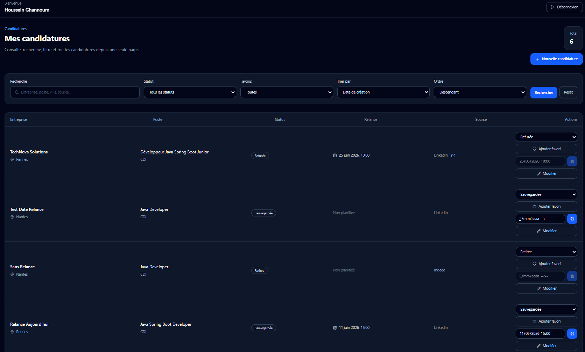
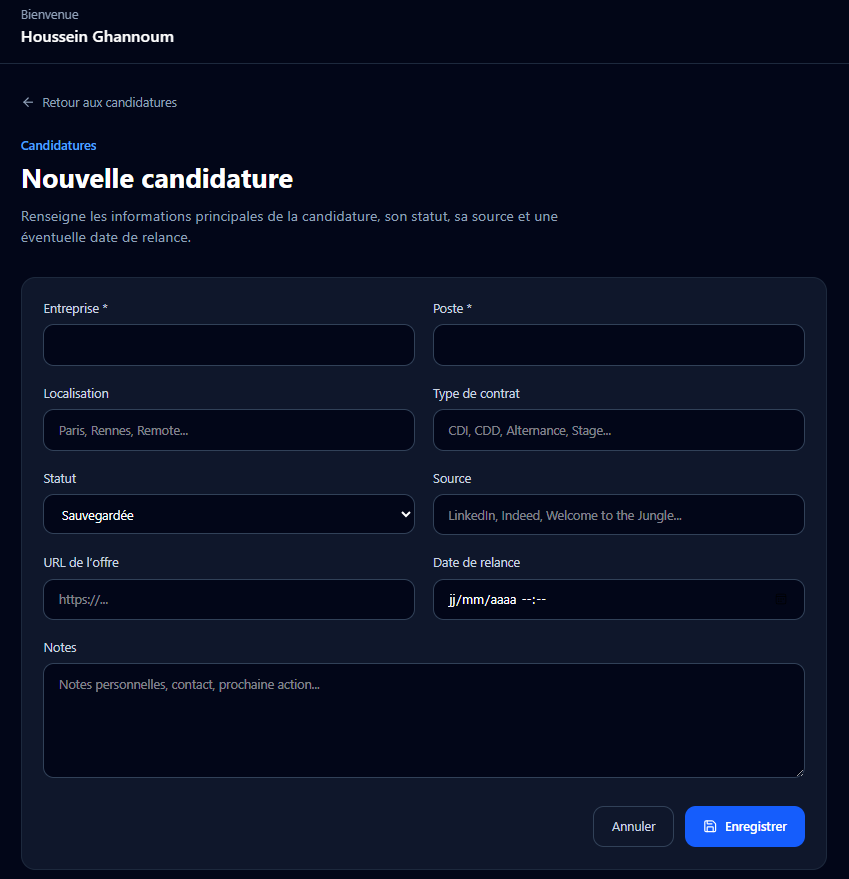
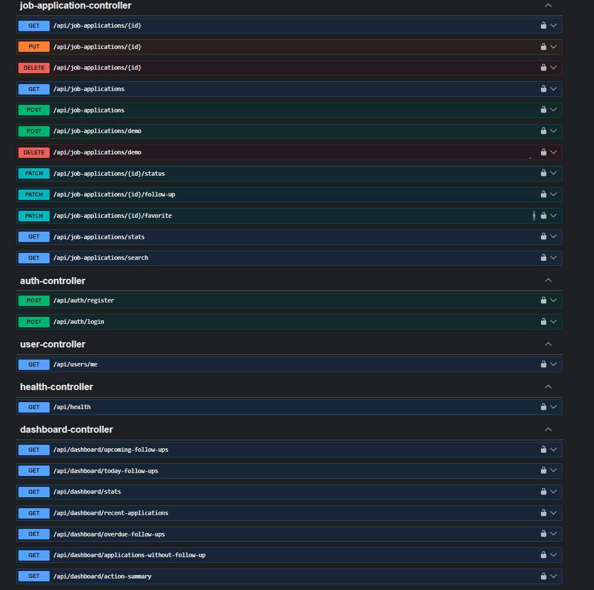

# JobPilot Secure

JobPilot Secure est une application web full-stack permettant de gérer ses candidatures, suivre les statuts, organiser les relances et visualiser un tableau de bord sécurisé.

Ce projet a été développé comme projet portfolio professionnel, avec une attention particulière portée à la sécurité, à la qualité du code, à l’architecture backend/frontend et à la documentation.

---

## Fonctionnalités principales

### Authentification sécurisée

- Inscription utilisateur
- Connexion utilisateur
- Authentification JWT
- Routes frontend protégées
- Redirection automatique si le token est absent ou expiré
- Déconnexion sécurisée

### Gestion des candidatures

- Création d’une candidature
- Modification d’une candidature
- Consultation d’une candidature
- Suppression d’une candidature
- Liste paginée des candidatures
- Recherche multi-champs
- Filtres par statut
- Filtre favoris
- Tri sécurisé
- Actions rapides :
  - changement de statut
  - ajout / retrait favori
  - modification rapide de la date de relance

### Suivi des relances

- Relances du jour
- Relances en retard
- Relances à venir
- Candidatures sans relance prévue
- Blocage des relances pour les candidatures terminées
- Validation des dates de relance

### Tableau de bord

- Statistiques globales
- Résumé des actions à traiter
- Liste des relances importantes
- Cartes de suivi :
  - candidatures sauvegardées
  - candidatures envoyées
  - entretiens
  - offres
  - refus
  - favoris

### Documentation et qualité

- Documentation Swagger / OpenAPI
- Tests unitaires backend
- Logs propres des requêtes API
- Séparation DTO / Entity
- Gestion centralisée des erreurs
- Pagination sécurisée
- Tri contrôlé côté backend

---

## Stack technique

### Backend

- Java 21
- Spring Boot
- Spring Security
- JWT
- Spring Data JPA
- PostgreSQL
- Flyway
- Maven
- JUnit
- Mockito
- Swagger / OpenAPI

### Frontend

- React
- TypeScript
- Vite
- Tailwind CSS
- Axios
- React Router
- Lucide React

### Infrastructure locale

- Docker
- Docker Compose
- PostgreSQL en conteneur

---

## Architecture du projet

```text
jobpilot-secure/
├── backend/
│   ├── src/main/java/com/jobpilot/backend/
│   │   ├── auth/
│   │   ├── common/
│   │   ├── config/
│   │   ├── dashboard/
│   │   ├── jobapplication/
│   │   └── user/
│   ├── src/main/resources/
│   └── src/test/
│
├── frontend/
│   ├── src/
│   │   ├── api/
│   │   ├── components/
│   │   ├── layouts/
│   │   ├── pages/
│   │   ├── routes/
│   │   ├── types/
│   │   └── utils/
│
├── docs/
│   └── screenshots/
│
└── docker-compose.yml
```

---

## Sécurité

Le projet inclut plusieurs mécanismes de sécurité :

- Authentification JWT
- Protection des routes backend
- Protection des routes frontend
- Association stricte des candidatures à l’utilisateur connecté
- Interdiction d’accéder aux données d’un autre utilisateur
- Validation des statuts
- Validation des dates de relance
- Filtrage sécurisé des champs de tri
- Limitation de la taille des pages
- Non-exposition des données sensibles dans les logs
- Documentation Swagger utilisable avec Bearer Token pour les routes protégées

---

## Installation locale

### 1. Cloner le projet

```bash
git clone https://github.com/votre-utilisateur/jobpilot-secure.git
cd jobpilot-secure
```

> Remplacer `votre-utilisateur` par votre nom d’utilisateur GitHub.

---

### 2. Démarrer PostgreSQL

```bash
docker compose up -d
```

---

### 3. Démarrer le backend

```bash
cd backend
./mvnw spring-boot:run
```

Sur Windows PowerShell :

```powershell
cd backend
.\mvnw spring-boot:run
```

Le backend sera disponible sur :

```text
http://localhost:8080
```

---

### 4. Démarrer le frontend

```bash
cd frontend
npm install
npm run dev
```

Le frontend sera disponible sur :

```text
http://localhost:5173
```

---

## Variables d’environnement frontend

Dans le fichier :

```text
frontend/.env
```

Ajouter :

```env
VITE_API_BASE_URL=/api
```

En développement, Vite redirige les appels `/api` vers le backend Spring Boot via le proxy configuré dans `vite.config.ts`.

---

## Documentation API

Swagger UI :

```text
http://localhost:8080/swagger-ui.html
```

OpenAPI JSON :

```text
http://localhost:8080/v3/api-docs
```

Pour tester les routes protégées dans Swagger :

1. Se connecter via `/api/auth/login`
2. Copier le JWT retourné
3. Cliquer sur `Authorize`
4. Coller le token JWT
5. Tester les routes protégées

---

## Tests

### Backend

```bash
cd backend
./mvnw clean test
```

Sur Windows PowerShell :

```powershell
cd backend
.\mvnw clean test
```

### Frontend

```bash
cd frontend
npm run build
```

---

## Exemples de routes API

### Authentification

```http
POST /api/auth/register
POST /api/auth/login
GET /api/users/me
```

### Candidatures

```http
GET /api/job-applications
POST /api/job-applications
GET /api/job-applications/{id}
PUT /api/job-applications/{id}
DELETE /api/job-applications/{id}
PATCH /api/job-applications/{id}/status
PATCH /api/job-applications/{id}/favorite
PATCH /api/job-applications/{id}/follow-up
```

### Dashboard

```http
GET /api/dashboard/stats
GET /api/dashboard/action-summary
GET /api/dashboard/today-follow-ups
GET /api/dashboard/overdue-follow-ups
GET /api/dashboard/upcoming-follow-ups
GET /api/dashboard/applications-without-follow-up
```

---

## Exemple de réponse API

### Statistiques du dashboard

```json
{
  "total": 10,
  "saved": 4,
  "applied": 3,
  "interview": 1,
  "offer": 1,
  "rejected": 1,
  "withdrawn": 0,
  "favorites": 2
}
```

### Résumé des actions

```json
{
  "todayFollowUps": 1,
  "overdueFollowUps": 1,
  "upcomingFollowUps": 2,
  "applicationsWithoutFollowUp": 1,
  "savedApplications": 4,
  "interviewApplications": 0
}
```

---

## Captures d’écran

Les captures peuvent être ajoutées dans :

```text
docs/screenshots/
```

Exemples recommandés :

```text
docs/screenshots/login.png
docs/screenshots/dashboard.png
docs/screenshots/applications.png
docs/screenshots/application-form.png
docs/screenshots/swagger.png
```

Quand les captures seront ajoutées, cette section pourra être complétée comme ceci :

```md
### Connexion



### Dashboard



### Liste des candidatures



### Formulaire de candidature



### Documentation Swagger


```

---

## Objectif professionnel

Ce projet démontre des compétences en :

- développement backend Java / Spring Boot
- développement frontend React / TypeScript
- sécurité web avec JWT
- conception d’API REST
- gestion de base de données PostgreSQL
- migrations Flyway
- tests unitaires
- documentation OpenAPI
- architecture full-stack moderne
- intégration frontend/backend
- bonnes pratiques de code et de sécurité

---

## Bonnes pratiques appliquées

- Architecture par domaine métier
- DTO pour séparer les données exposées de l’entité JPA
- Repository Spring Data JPA
- Services métier séparés des contrôleurs
- Validation des règles métier côté backend
- Centralisation des appels API côté frontend
- Interceptor Axios pour ajouter automatiquement le JWT
- Routes protégées côté frontend
- Logs HTTP propres avec identifiant de requête
- Tests unitaires avec JUnit et Mockito

---

## Sources techniques

Documentation officielle utilisée comme référence :

- Spring Boot : https://spring.io/projects/spring-boot
- Spring Security : https://spring.io/projects/spring-security
- Spring Data JPA : https://spring.io/projects/spring-data-jpa
- React : https://react.dev
- React Router : https://reactrouter.com
- Vite : https://vite.dev
- Tailwind CSS : https://tailwindcss.com
- Axios : https://axios-http.com
- PostgreSQL : https://www.postgresql.org
- Flyway : https://documentation.red-gate.com/fd
- Docker : https://docs.docker.com
- Swagger / OpenAPI : https://swagger.io/specification

---

## Auteur

Houssein Ghannoum

Projet réalisé dans le cadre d’un portfolio développeur Java / Spring Boot / React.
